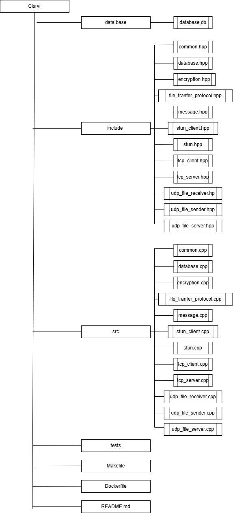

# 
⁺˚⋆｡°✩₊✩°｡⋆˚⁺ClSrvrvMessager⁺˚⋆｡°✩₊✩°｡⋆˚⁺

**ClSrvrvMessager** Проект представляет собой *простой мессенджер с клиент-серверной архитектурой*, написанный на C++ с использованием библиотеки Boost.Asio. Он включает:
  - 🖥 Сервер, слушающий TCP-подключения от клиентов. Клиенты могут регистрироваться, отправлять и получать текстовые сообщения через сервер
  - 👨🏻‍💻Клиент, который делает STUN-запрос для определения своего публичного IP/порта,одключается к серверу и регистрируется, передавая ему свой публичный адрес, отправляет и получает текстовые сообщения по TCP, для передачи файлов использует UDP с простейшим механизмом подтверждения (ACK) каждого блока

Немного дополнительной информации

  Структура проекта многофайловая, есть Makefile для сборки. Код учитывает базовые требования, такие как выравнивание STUN-пакетов по RFC 5389, сериализация/десериализация сообщений, обработка ошибок при сетевых операциях, а также логику асинхронного ввода-вывода с помощью Boost.Asio.

***
### **📄 Содержание**
1. Требования 
2. Используемые технологии 
3. Спецификации
4. Основные возможности
5. Cтруктура проекта
7. Установка и запуск 
   - Клиент 
   - Сервер
8. Примеры реализации 
***

### **✅ Требования** 
- Компилятор C++ <u>с поддержкой C++17</u> или новее. Рекомендуется GCC 7+ или Clang 5+. 
- Установленный <u>Boost.Asio и Boost.System</u>
- Системные инструменты для сборки(make или аналогичная утилита сборки)
- Подключение к интернету (для STUN)
***
### **🌐 Используемые технологии**  
- Язык программирования: C++17
- Библиотека Boost.Asio - для асинхронного сетевого ввода-вывода (TCP и UDP)
- Boost.System - для обработки системных ошибок и взаимодействия с Boost.Asio
- STUN (Session Traversal Utilities for NAT, RFC 5389) - позволяет определить публичный IP/порт клиента за NAT
- TCP и UDP - для гарантированной доставки текстовых сообщений и сигнальных данных и для быстрой передачи файлов с примитивным механизмом подтверждения соответсвенно 
- Makefile - для сборки проекта, упрощая процесс компиляции и линковки зависимостей.
***
### **📘 Спецификации** 
В основе нашего решения лежит концепция использования нескольких протоколов и стандартов, дополняющих друг друга. Такой подход позволяет обеспечить надёжную, удобную и гибкую коммуникацию даже при сложных сетевых условиях

#### STUN (RFC 5389)

 

  
Перед погружением в подробности советуем узнать, что же такое NAT

   NAT (Network Address Translation) — это технология, широко применяемая в маршрутизаторах и межсетевых экранах для переотображения «внутренних» адресов локальной сети на один или несколько публичных IP-адресов.Однако NAT усложняет прямое взаимодействие между хостами, находящимися за разными NAT-устройствами. Когда клиент пытается установить соединение извне, он видит только публичный адрес, присвоенный маршрутизатором, но не знает внутренний адрес хоста, находящегося за NAT. 

Проблема, с которой мы столкнулись, заключалась в том, что без знания своего публичного адреса хост, находящийся за NAT, не может сообщить другим участникам сети, как к нему подключиться напрямую. Если бы мы попытались просто обменяться адресами, клиенты за NAT не смогли бы установить соединение друг с другом, так как их внутренние IP-адреса (например, 192.168.x.x) не видны и не маршрутизируются в глобальной сети.
Как мы это решили? 
Для определения публичного IP-адреса и порта клиента, скрытого за NAT, мы применяем протокол STUN (Session Traversal Utilities for NAT). Его ключевая задача — помочь клиенту «увидеть себя извне»: отправив Binding Request на STUN-сервер, клиент получает в ответ свой публичный адрес. Это открывает путь к прямому взаимодействию между клиентами, расположенными в различных сетях, и даёт возможность гибко работать в условиях разнообразных NAT-конфигураций.
>- [❌] Реализация через простую локальную сеть
>- [✅] Грандиозный проект с реализацией STUN протокола 

#### **TCP для текстовых сообщений**

**TCP (Transmission Control Protocol)** — это надёжный протокол транспортного уровня, используемый для передачи данных, в том числе текстовых сообщений, между клиентом и сервером. TCP обеспечивает гарантированную доставку сообщений в правильном порядке.
Как работает этот протокол? Для передачи текстовых сообщений с использованием TCP, сервер открывает сокет и "слушает" входящие соединения, а клиент устанавливает связь и отправляет данные. Сообщения передаются в виде байтовых потоков, которые на принимающей стороне преобразуются обратно в читаемый текст.
#### **UDP для передачи файлов**
Для пересылки файлов используется **UDP (User Datagram Protocol)**, поскольку он:
- Быстрее и не требует установки надёжного соединения, что снижает задержки.
- Гибче, т.е позволяет реализовать собственные механизмы подтверждений по блокам (ACK), адаптируясь к конкретным требованиям к скорости или надёжности.

Мы не используем ❌«голый»❌ UDP — поверх него реализован простой протокол, отправляющий данные небольшими фрагментами и ожидающий подтверждения (ACK) от получателя. Если подтверждение не приходит, отправитель может повторно выслать утерянный фрагмент. Такой подход обеспечивает хороший баланс между производительностью и надёжностью, не перегружая логику сложными схемами контроля потока и повторной передачи.

#### **Документация Boost и использование Boost.Asio**
Для реализации сетевого взаимодействия мы применили библиотеку Boost.Asio — один из наиболее известных инструментов для асинхронного ввода-вывода в C++. Её ключевые особенности:
- Асинхронная модель позволяет эффективно использовать ресурсы и обслуживать множество подключений.
- Boost.Asio поддерживает TCP, UDP, таймеры и другие механизмы ввода-вывода, обеспечивая единый интерфейс для различных операций.
- В официальной документации (см. [Boost.Asio Documentation](https://www.boost.org/doc/libs/master/doc/html/boost_asio.html)) можно найти примеры, руководства и описания API. Это облегчает освоение библиотеки и ускоряет процесс разработки.

При разработке мы опирались как на стандартные примеры из документации, так и на описание протоколов (RFC 5389 для STUN, спецификации TCP/UDP). Это помогло нам создать решение, сочетающее удобство и гибкость Boost.Asio с надёжностью хорошо проработанных сетевых протоколов.
***
### **🤖 Основные возможности**   
Мессенджер объединяет в себе все ключевые элементы для удобного общения за пределами локальных сетей. Клиент, прежде чем подключиться, определяет свой публичный адрес с помощью STUN, упрощая взаимодействие при работе через NAT. Сервер служит «хабом» для всех подключений, перенаправляя текстовые сообщения от одного пользователя к другому, а для передачи файлов предусмотрен лёгкий и быстрый канал по протоколу UDP с базовым механизмом подтверждения доставки. Такой подход обеспечивает плавный обмен данными и упрощает совместную работу, делая процесс коммуникации максимально прозрачным и доступным
***
### **☰ Cтруктура проекта**

Проект организован по классической схеме: в директории src/ располагается исходный код, отвечающий за основную логику работы, а в include/ — заголовочные файлы с интерфейсами и общими определениями.

Тут вы можете по подобробнее узнать про элементы реализации: 

src/:

  
main_server.cpp

  точка входа для запуска сервера.

  
main_client.cpp

   точка входа для запуска клиента.

  
common.cpp

   реализация общих функций (логирование, вспомогательные утилиты).

  
stun.cpp, stun_client.cpp

   реализация STUN-клиента

  
tcp_server.cpp, tcp_client.cpp

   реализация сервера и клиента для обмена сообщениями по TCP

  
udp_file_sender.cpp, udp_file_receiver.cpp

   реализация отправки и приёма файлов по UDP

  
message.cpp

   реализация сериализации сообщений

  
file_transfer_protocol.cpp

   реализация протокола передачи файлов

  
encryption.cpp

  реализация XOR шифрования

  
database.cpp

   описание взаимодействия с базами данных

Makefile

  
make

   Скрипт сборки проекта. Выполнение команды make сгенерирует исполняемые файлы для сервера и клиента.

***
